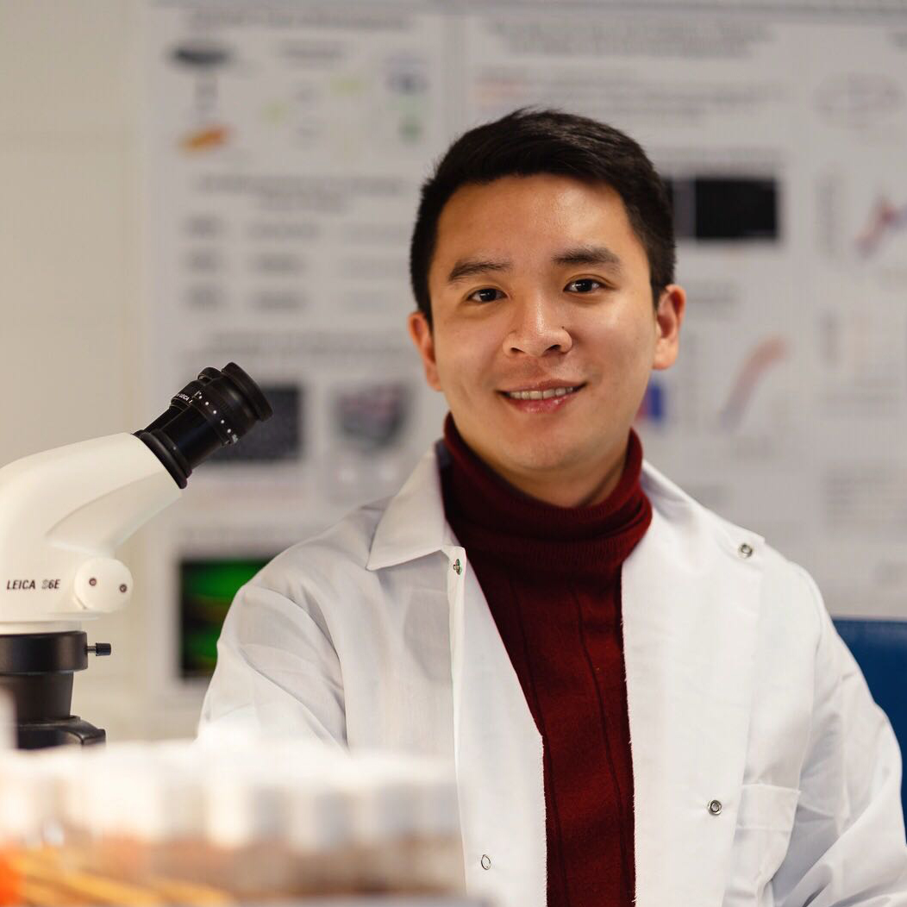

   

**Xun Wang, Ph.D.**

[Kamm Mechanobiology Lab](https://web.mit.edu/meche/mb/)  | [Guo Lab of Cell Mechanics](https://www.guolab.mit.edu/)

Departments of Mechanical and Biological Engineering, MIT

[Choi Lab](https://www.massgeneral.org/neurology/research/genetics-aging-research-unit/choi-lab), Genetics and Aging Research Unit

Department of Neurology & McCance Center for Brain Health

Massachusetts General Hospital | Harvard Medical School

Email: [xunwang AT mit DOT edu](xunwang@mit.edu) | [xwang120 AT mgh DOT harvard DOT edu](xwang120@mgh.harvard.edu)

Website: [https://www.mit.edu/~xunwang](https://www.mit.edu/~xunwang/)
