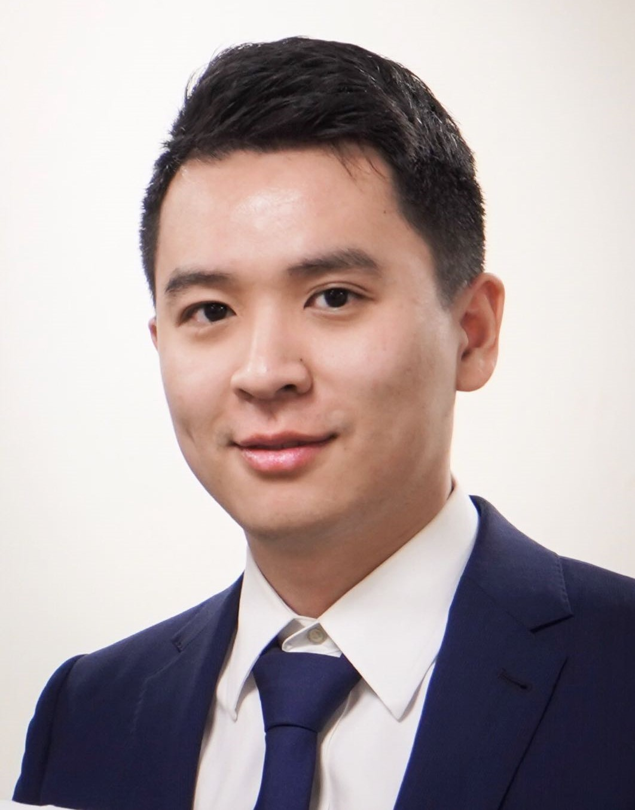

   

**Xun Wang** is a postdoctoral fellow in [the department of Mechanical Engineering](https://me.columbia.edu/), [Columbia Univerisity](https://www.columbia.edu/) in the City of New York. He serves as a research assistant in [the Kasza Living Materials Lab](http://www.kaszalab.com/) and a teaching assistant for the course MECE 3038 Mechanical Engineering Laboratory. He researches on ***in vivo* biomechanics and morphogenesis**. Currently, he is utilizing transgenic techniques, live confocal imaging and quantitative image analysis to study tissues mechanics and morphogenesis.

Xun received a B.S. in Mechanical Engineering and Automation and a B.A. in Germen from [Shanghai Jiao Tong University](http://en.sjtu.edu.cn/) in 2014, a M.S. and M.Phil in Mechanical Engineering from [Columia University](https://www.columbia.edu/) in 2016 and 2018. He was the recipient of the National Scholarship of China in 2012 and 2013. 

