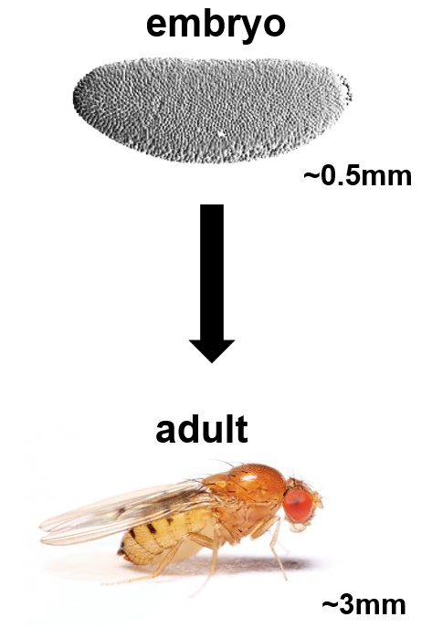
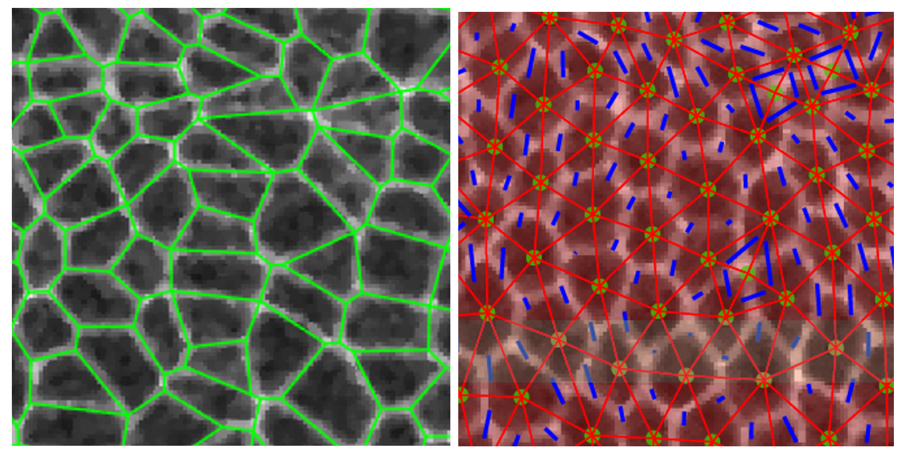

One of the biggest challenges in engineering tissues in the lab and developing bio-inspired materials is the gap between our knowledge of small-scale building blocks (genes, proteins, cells etc.) and large-scale structures (tissues, organs, body forms etc.). Morphogenesis, the generation of biological shape and structure, is a crucial bridge across these length scales. There are significant mechanical factors, including forces and tissue mechanical properties, involved in morphogenesis yet remaining poorly understood. By developing a systematic, quantitative, *in vivo* experimental toolbox and working with models of tissue mechanics, my research goal is to advance fundamental understanding of how cells build tissues with precise mechanical properties required for proper biological function. My work sheds light on understanding human development and the improper tissue mechanics associated with birth defects, errant wound healing and cancer.

    
    

**Fig 1.** Morphogenesis: A 0.5mm-long single-layer epithelial tissue generates a 3mm-long adult fruit fly rapidly in just 1 day (25℃) with dramatic structural and shape changes.
**Fig 2.** Quantitative methods: Segmentation and tensor analysis of epithelial tissues *in vivo*.

